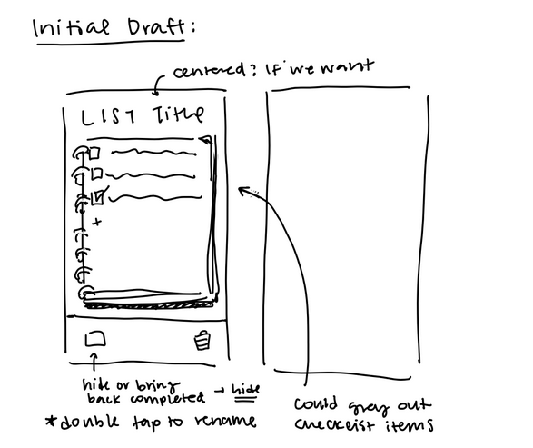
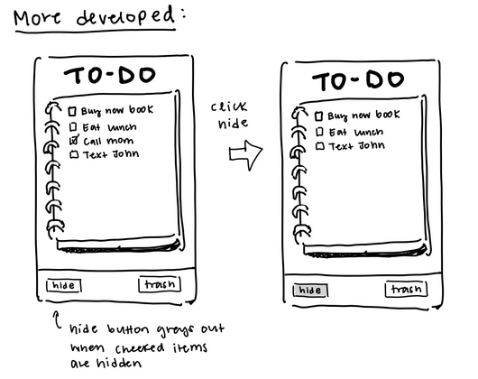
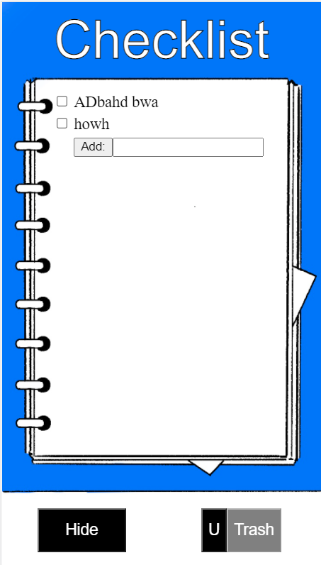
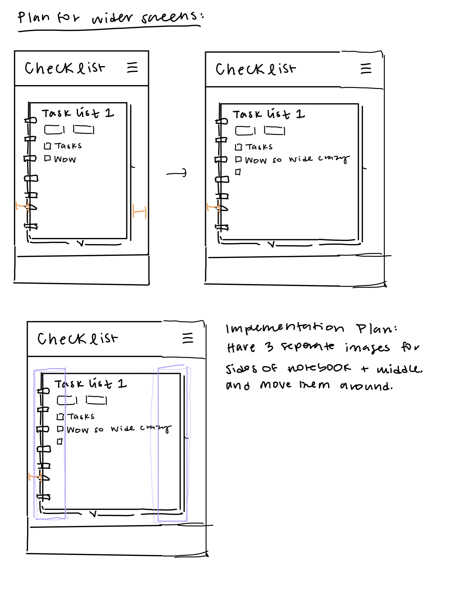

# Design Document

## Initial ideas
Our design started as a a box within the screen you could slide up and down as needed to view the list items  (scroll wheel). 

Then we added buttons below to do the various actions. Specifically the notebook items could be individually selected (shown with highlight) and then the buttons would act on them. We chose 

## Improvements 

Then we started to refine those ideas with physicality and mobile design preferences. Changed the "rename" button into double tapping the names (might need a note to explain it but seems intuitive/conceptually prevalent in mobile design). We also designed the "highlighting" would be connected to a check box and this would be "complete" or not. Moved the new item section to underneath the last item of the list as a plus button. 
We chose to keep delete and show all completed items as seperate buttons to clearly show their intent. If we include an individual delete system it would be a trash can hidden behind a lock (ie only visible when a lock button is pressed)

We added some visual additions by making the scroll box on a notebook image (but without ruled lines so we dont have to line it up)

## Design implementation for Lab 2 

Most of the initial design stayed the same. There was some aesthetic changes (such as with add
item) but the actual function and layout was not. 

The biggest change was the addition of the Lock system for the trash button. In order to prevent accidental 
trashing of selected items, we added a Lock button. Before unlock is selected (marked by a U), the trash button 
is grayed out and does not work. Once clicked, the trash button is then usable. If necessary you 
can relock the trash icon by pressing the lock button (marked by a L). We wanted some better images or text 
to display intent but that is a change for another day (due to time constraits)

As for challenges we faced. There was some issues with making the tasks editable once sent. 
Eventually we managed to ditch the Input unit and just made a "contentedible" div. This works for now 
but may have trouble saving data later. We also struggled making a popup for the trash button that in no way
influenced our choice to make a lock button. 

## User Testing for Lab 2
(note this was before the lock was added)

USER TESTING with Zoe Kedzierski, completed 3/3/2022 after most Javascript features were implemented, but prior to the lock button being added

Q: What is your first impression of what this app is?

A: It looks like the Reminders app. Based on the title it’s a checklist to keep track of whatever tasks you have.

--

Q: Can you try adding an item?

A: I feel like I would click the text prompt and then click add.

User added ‘text olivia’ to list

(This was correct, so it was a good sign for our app)

(As a side note, User seemed to intuitively check off items to be done with the checkbox, as well as edit items)

--

Q: Can you now try deleting an item?

A: I think I would try checking off an item maybe? And then hitting trash?

User checked off an item and then tried hitting Trash. This did not work, so they instead tried Hide, which hid the item and didn’t delete it.

--

Q: What do you now think show does?

A: I think it would show the item I just hid

User then unhid the items.

User continued to seem confused about how to delete an item until the highlighting was pointed out.

--

Q: Can you now try to delete multiple items?

User deleted multiple items

(They still weren’t able to figure it out on their own very quickly though)

--

Q: Do you have any closing thoughts about your experience?

A: I was not ready for there to be multiple ways to select. It threw me off my game and made things more confusing.

(We should likely find a new and more intuitive way to delete tasks in future versions of the app, as the highlighting and checking off seem to be confusing.
Also, upon reflecting on this user testing, the lock button might make this even more confusing, which we will also reconsider in our next implementation)

## Adjustments for Larger Screen Sizes

We slightly adjusted our design for larger screens by making the notebook background expand or contract based on screen size. We also added the ability for the user to make different lists, and this was put in a menu at the top, accessible by hamburger button. Our initial plan for the expanding screen size is shown below.

We also added accessibility changes, including tab functionality and a 'Big Text' mode in the hamburger menu. 

Also, in response to the editing / selecting being confusing based on user testing for Lab 2, we created a button that allows users to edit tasks so that selecting was more clear. We also changed the lock botton for deleting to an icon of a lock to make it's purpose more obvious.

[Link for text to speech video](https://youtu.be/kNXnDQKyvFU)

[Link for keyboard only video](https://youtu.be/Ljw2v636ifo)

## User texting for Lab 4

User testing performed with Zoe Kedzierski, completed 4/10/2022

Q: Can you try to add an item to the list?

User typed a new item into the text box at the bottom and hit add, adding an item

--

Q: Can you now delete that item?

User selected the item to be deleted, then tried to click the trash button multiple times, but was confused that it didn't work (it was locked at the time). After a few more tries, the  user tried clicking the lock button and the trash button unlocked.

A: The lock was confusing; I've never seen that in an app and it didn't feel intutitive.
(Our Lab 2 user testing was completed before the addition of the lock button, so this is the first time we've done user testing with it)

--

Q: Can you now make a new list for groceries?

User clicked the hamburger menu icon, then tried clicking the 'Create new list' button repeatedly. User was really confused why that wasn't doing anything, then realized they needed to use the text box and created a new list. 

--

Q: Can you delete your previous list?

User selected the list and then deleted it. When they closed the hamburger menu though they were confused why the list was still appearing (this is something we should definitely fix haha)

--

Q: Can you rank the priority of different items on your list and sort by them?

User had no issues changing priority and toggling the sort.

--

We could improve our design by removing the lock buttons, as they seem to be confusing for the user. We can also place the text box in the hamburger menu before the 'Create New List' button, as that's probably more intuitive.

## Rules for Sharing That We Chose for Lab 5

1. If user A shares a list with user B, user B can share that list with user C.
2. If user A shares a list with user B, user B can delete that list.
3. If user A shares a list with user B, the list is automatically shared with B.
4. The shared lists are not distinguishable in the UI from unshared lists.
5. If user A shares a list with user B, B cannot see if A does not have a verified email address.

Also, we made it so that if you have one list, you cannot delete that list. You need at least 1. 

## User testing for Lab 5

User testing was performed with Anandi Williams, completed 5/9/2022

--

Q: First, can you try to make an account?

User entered an email and created a password, and clicked log-in. They commented that they expected the login-in page to be centered, and also found the "password" label slightly confusing for creating a new user. They expected something more like "create new password"

--

Upon logging in, the user read the prompt on the notepage and went to the menu to create a list. The user added an emoji which worked which was a fun surprise.

After creating a list, the user was able to easily add items.

--

Q: Can you try deleting an item? 

The user was at first confused with selection. They then tried to click the delete button, but were confused when nothihng deleted.

After prompting the user to explore the lock button, the user then realized how to delete.

--

Q: Can you try sharing a list with another user?

The user clicked the menu and successfully entered an email to share the list with.

--

Q: Can you log out?

The user was easily able to log out using the menu.

--

For a future version of this app, we'd want to redesign the login page slightly. We should also remove the lock button on delete buttons and possibly change it to a double click or something. The lock is not very intuitive for users.

